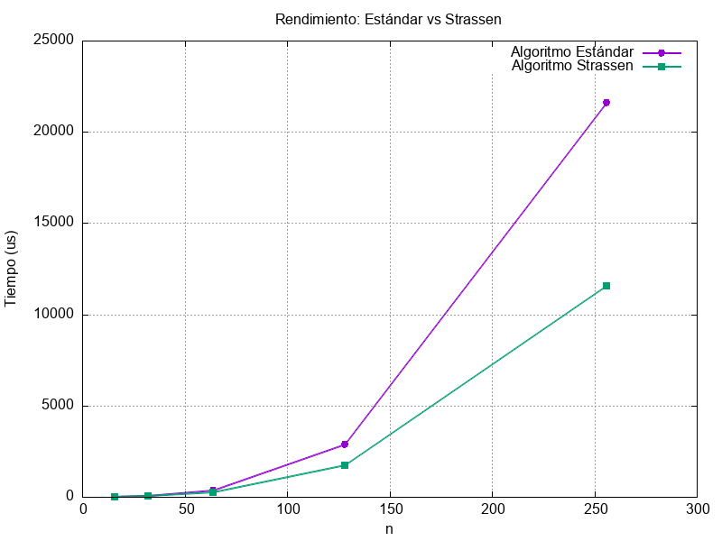

# Análisis Empírico de Multiplicación de Matrices  
## Estándar vs. Strassen

Este proyecto documenta el diseño, implementación y evaluación experimental del algoritmo de **Strassen** frente al método clásico de multiplicación de matrices.

El objetivo principal es determinar el umbral crítico $N_0$ a partir del cual la reducción de complejidad asintótica de Strassen compensa la sobrecarga introducida por la recursión y la gestión dinámica de memoria.

---

# Estructura del Proyecto

```text
.
├── bin/                # Ejecutables compilados
├── data/               # Archivos de salida (datos y gráficas)
├── src/                # Código fuente en C++
│   └── main.cpp
├── Makefile            # Automatización de tareas
└── README.md           # Documentación del proyecto
```

---

# 1. Especificaciones del Sistema y Entorno

Para garantizar la reproducibilidad de los resultados experimentales, se utilizó el siguiente entorno de ejecución:

| Componente | Descripción |
|---|---|
| **Sistema Operativo** | Arch Linux (Kernel 6.19.11-arch1-1) |
| **Procesador (CPU)** | Intel(R) Core(TM) i5-8250U @ 1.60GHz |
| **Núcleos / Hilos** | 4 núcleos / 8 hilos |
| **Memoria RAM** | 7.6 GiB |
| **Compilador** | g++ (GCC) 15.2.1 20260209 |
| **Estándar de C++** | C++17 |
| **Flags de compilación** | `-O3 -Wall -march=native` |

---
# 2. Herramientas Utilizadas

- **GNU Make**
- **Gnuplot**


---

# 3. Descripción de la Implementación

## 3.1. Algoritmo Estándar

Se implementó el método clásico de multiplicación de matrices con complejidad:

```math
O(n^3)
```

La implementación utiliza tres bucles anidados y trabaja mediante **offsets** (coordenadas de inicio) para evitar copias innecesarias de submatrices, reduciendo el consumo de memoria y mejorando la localidad de referencia.

---

## 3.2. Algoritmo de Strassen

La implementación sigue el paradigma de **Divide y Vencerás**, reduciendo el número de multiplicaciones recursivas de 8 a 7 productos intermedios:

```math
P_1, P_2, \dots, P_7
```

Su complejidad asintótica es:

```math
O(n^{\log_2 7})
```

### Características Técnicas

- **Gestión de memoria:**  
  Uso de `std::vector<std::vector<double>>` con alocación dinámica controlada en cada nivel recursivo.

- **Algoritmo híbrido:**  
  El sistema conmuta automáticamente al método estándar cuando:

```math
n \leq 32
```

Esto optimiza el rendimiento en matrices pequeñas, donde la sobrecarga recursiva de Strassen resulta contraproducente.

---

# 4. Interfaces Principales

Para mantener la modularidad y evitar particiones físicas en memoria, las operaciones algebraicas trabajan mediante referencias y offsets de filas (`r`) y columnas (`c`).

## Alias de tipo

```cpp
using Matrix = std::vector<std::vector<double>>;
```

---

## Operaciones auxiliares

```cpp
void sumar(const Matrix& A, int rA, int cA, const Matrix& B, int rB, int cB, Matrix& C, int n);

void restar(const Matrix& A, int rA, int cA, const Matrix& B, int rB, int cB, Matrix& C, int n);
```

---

## Multiplicación estándar

```cpp
void multiplicacionEstandar(const Matrix &A, int rA, int cA,  const Matrix &B, int rB, int cB, Matrix &C, int rC, int cC, int n);
```

---

## Implementación de Strassen

```cpp
void strassen(const Matrix &A, int rA, int cA, const Matrix &B, int rB, int cB, Matrix &C, int rC, int cC, int n);
```

---

# 5. Objetivo Experimental

El propósito del benchmark es identificar experimentalmente el valor de:

```math
N_0
```

tal que:

- Para:

```math
n < N_0
```

el algoritmo estándar es más eficiente debido a menores costos constantes.

- Mientras que para:

```math
n \geq N_0
```

el algoritmo de Strassen comienza a superar al método clásico gracias a su menor complejidad asintótica.

En esta implementación, se utiliza una estrategia híbrida donde el algoritmo de Strassen delega automáticamente al método estándar cuando:

```math
n \leq 32
```

Esto permite reducir la sobrecarga recursiva y optimizar el rendimiento práctico del sistema.

---

# 6. Resultados y Visualización

Durante la ejecución, el programa:

1. Ejecuta múltiples benchmarks para distintos tamaños de matrices.
2. Calcula tiempos promedio de ejecución en microsegundos.
3. Exporta automáticamente los resultados al archivo:

```text
data/resultados.dat
```

Posteriormente, las herramientas de automatización procesan estos datos para generar una comparativa visual entre ambos algoritmos.

## Gráfica Generada


La visualización utiliza una **escala logarítmica en ambos ejes (log-log)** para representar de forma más clara el crecimiento temporal de los algoritmos conforme aumenta el tamaño de las matrices.

La gráfica muestra el comportamiento temporal del algoritmo estándar frente a una implementación híbrida de Strassen con umbral:

```math
n \leq 32
```

Los resultados experimentales muestran que:

- Para tamaños pequeños, ambos algoritmos presentan tiempos muy similares debido al uso del método estándar en los niveles inferiores de recursión.
- A medida que aumenta la dimensión de las matrices, Strassen comienza a reducir progresivamente el tiempo de ejecución respecto al algoritmo clásico.
- El umbral híbrido mejora el rendimiento práctico al disminuir los costos constantes asociados a la recursión.
- La ventaja de Strassen se vuelve más evidente en matrices grandes, donde la reducción de complejidad asintótica domina el tiempo total de ejecución.

Los resultados obtenidos son consistentes con el comportamiento teórico esperado:

```math
O(n^3) \quad \text{vs} \quad O(n^{\log_2 7})
```

---


# 7. Instrucciones de Uso

## Comandos Disponibles

| Comando | Descripción |
|---|---|
| `make` | Compila el proyecto y genera el ejecutable `matrix_bench`. |
| `make run` | Ejecuta el benchmark y guarda los resultados en `/data`. |
| `make plot` | Ejecuta el flujo completo y genera `data/grafica.png`. |
| `make clean` | Elimina binarios y archivos temporales. |

---

## Ejemplo de Ejecución

```bash
make clean
make plot
```
